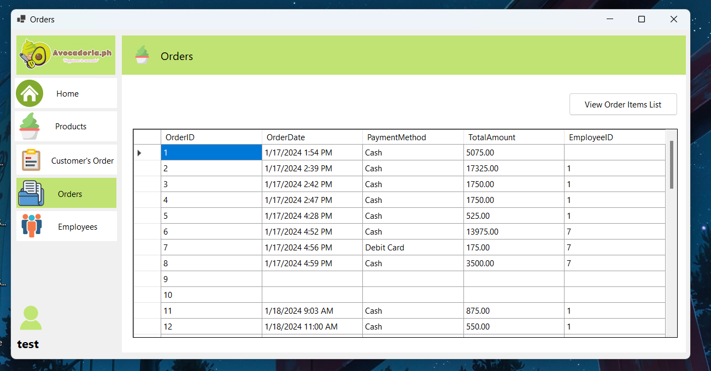

# Avocadoria Ice Cream Store POS Desktop App

Welcome to the **Avocadoria Ice Cream Store POS Desktop App**, a streamlined Point-of-Sale system designed to manage the operations of our avocado ice cream store. This desktop application allows employees to efficiently handle products, customer orders, and employee management.

---

## Features

### 1. **Login System**
- Employees log in with their credentials to access the system.
- Permissions are set to restrict certain pages to specific roles (e.g., Owners can manage employees).

### 2. **Home Page**
- Navigation hub where employees can:
  - Log out.
  - Access other pages like Products, Customer Orders, Orders History, and Employees.

### 3. **Products Page**
- Add and manage products.
- Products added here will automatically appear in the Customer's Order page for selection.

### 4. **Customer's Order Page**
- Create customer orders by:
  - Selecting products from the product table.
  - Entering quantity and variations.
  - Calculating the total amount.
  - Choosing a payment method.

### 5. **Orders Page**
- View order history, including:
  - Details of past transactions.
  - Payment records.

### 6. **Employees Page**
- Manage employee accounts:
  - Add new employees.
  - Assign specific permissions.
- This page is only accessible to users with the necessary privileges (e.g., Owners).

---

## Technology Stack

- **Programming Language:** C#
- **Development Environment:** Microsoft Visual Studio
- **Database:** Local database for managing products, orders, and employees (details to be configured in `Program.cs`).

---

## How to Run

1. **Prerequisites**
   - Install [Microsoft Visual Studio](https://visualstudio.microsoft.com/).
   - Clone or download this repository to your local machine.

2. **Steps**
   - Open the solution file (`.sln`) in Visual Studio.
   - Locate `Program.cs` and ensure database connections are properly configured.
   - Run the application by pressing `F5` or clicking on the "Start" button in Visual Studio.

---

---

## Contributing
This project was developed as part of our **Fundamentals in Database Systems Class Project**. Contributions are welcome for enhancements or fixes.

---

Feel free to reach out for any questions or suggestions!
